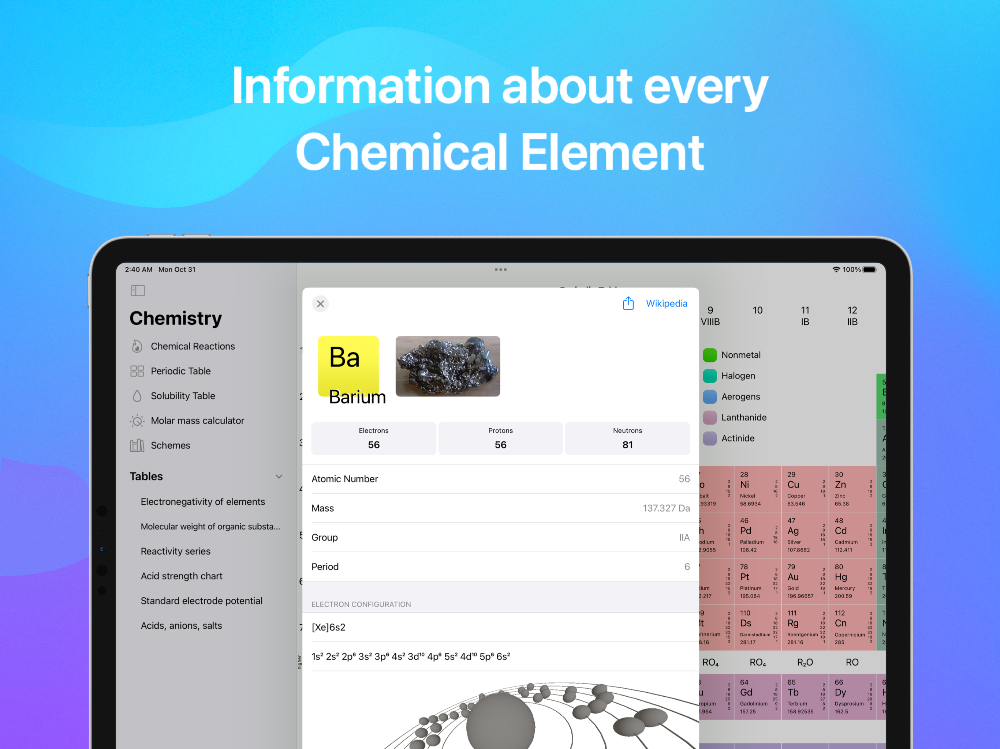

# About Me

🚀 I am a mobile app developer with a passion for creating beautiful and intuitive apps for iOS, iPadOS, macOS, and Android platforms. I specialize in creating educational and scientific apps, such as 🔬 Chemistry and 📚 Math Guru, as well as design-related apps like 🎨 Mesh Gradients. My goal is to make learning and creating more accessible and enjoyable for users.

# My Projects

## 🔬 Chemistry

Chemistry is a powerful tool that helps users to solve chemical equations and search chemical reactions easily. The app includes a convenient interactive Periodic Table, a calculator of molar masses, a solubility table, and Acid strength chart. The app also features offline access to information about chemical elements, a search button to find elements by name or symbol, widgets to easily remember the periodic table and chemical elements, and all these tables and charts are available in the free Chemistry app. [Download on the App Store](https://apps.apple.com/app/chemistry/id493558583?pt=965231&ct=github_diniska&mt=8) [Download on Google Play](https://play.google.com/store/apps/details?id=com.chemistry)

## 📚 Math Guru

Math Guru is a mobile mathematical trainer that helps users become a pro in solving quadratic equations. The app includes an endless supply of new tasks and explanations on how to solve the tasks, making it easy to understand the math theory and real examples. The app includes practice on solving quadratic equations with Vieta's theorem, exponentiation, exponential equations, fractions simplification, and divisibility rules. [Download on the App Store](https://apps.apple.com/app/math-guru/id1624262731?pt=965231&ct=github_diniska&mt=8)

## 🎨 Mesh Gradients Ultimate

Mesh Gradients Ultimate is a powerful tool for creating mesh gradients of any size, shape, and color. The app's easy-to-use interface allows users to customize the transparency and mesh lines of the gradients for more control over the design. [Download on the App Store](https://apps.apple.com/app/mesh-gradients-ultimate/id6444388499?pt=965231&ct=github_diniska&mt=8)

# Contact
- Email: _\<hidden>_
- Insta: [diniska](http://instagram.com/diniska)
- Twitter: [diniska\_](https://twitter.com/diniska_)
